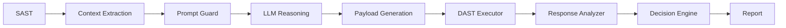

# Heimdall V2

Heimdall V2 is a research prototype for closed-loop security validation in a DevSecOps pipeline. It combines Static Application Security Testing (SAST), structured LLM-based exploitability reasoning, safe payload generation, dry-run Dynamic Application Security Testing (DAST), response analysis, and reproducible reporting.

The project is intended for authorized research, classroom, and local lab environments only. Dynamic validation defaults to dry-run behavior and local or explicitly allowlisted targets.

## Project Overview

Heimdall V2 provides two related interfaces: the Streamlit security lab application and a reproducible experiment runner for research evaluation. The experiment runner is the recommended interface for paper metrics because it produces stable CSV, JSON, and Markdown artifacts from a labeled dataset.

Current Streamlit application capabilities:

- The Streamlit interface now follows the Base44 reference style: compact HD header, left control center, neutral cards, status pills, and finding summary tiles.
- Safe ZIP extraction blocks path traversal and skips dependency folders such as `node_modules`, `.git`, and `__pycache__`.
- SAST-only mode no longer requires an OpenAI API key.
- Semgrep failures are shown clearly instead of silently producing empty results.
- Semgrep is launched from PATH first, then through the active Python module path as a fallback.
- All findings are ranked and displayed instead of only using the first result.
- Users choose which finding to validate.
- DAST validation requires an explicit authorization checkbox.
- DAST target URLs are checked before live requests are sent.
- AI verdicts are combined with simple HTTP-response heuristics for better accuracy.
- AI JSON responses are handled safely so malformed model output does not crash the app.
- AI prompts now apply prompt-injection guardrails by treating findings and HTTP evidence as untrusted data and truncating long fields before model review.
- API keys are read from Streamlit input or `OPENAI_API_KEY`, not hardcoded in source files.

## Problem Statement

SAST tools are useful for broad code coverage, but they often produce false positives because static analysis cannot always observe runtime behavior, authentication state, framework sanitization, or application-specific controls. Heimdall V2 evaluates whether static alerts can be converted into safe validation hypotheses and then classified as True Positive, False Positive, or Needs Review.

## Architecture



The pipeline is modular:

- `heimdall/evaluation/` contains dataset loading, baselines, metrics, and error analysis.
- `heimdall/pipeline/` contains context extraction, prompt guarding, LLM output validation, payload generation, DAST safety controls, response analysis, and final decision logic.
- `experiments/run_experiment.py` runs reproducible baseline comparisons and writes paper-ready reports.

## Installation

```bash
python -m venv .venv
.venv\Scripts\activate
pip install -r requirements.txt
```

For macOS or Linux:

```bash
python3 -m venv .venv
source .venv/bin/activate
pip install -r requirements.txt
```

## Streamlit Application

The original Streamlit interface can be started with:

```bash
streamlit run app.py
```

The web interface supports ZIP upload, Semgrep execution, ranked findings, AI-assisted payload generation, and optional authorized validation.

## Quickstart: Reproducible Experiment

Run all baseline modes against the included sample dataset:

```bash
python experiments/run_experiment.py --dataset data/sample_alerts.jsonl --mode all --output reports
```

Generated outputs:

- `reports/summary.md`
- `reports/summary.json`
- `reports/results.csv`
- `reports/error_analysis.md`

## How To Run Experiments

Use the experiment runner with a JSONL dataset and an output directory:

```bash
python experiments/run_experiment.py --dataset data/sample_alerts.jsonl --mode all --output reports
```

## How To Run Baseline Comparison

The `all` mode runs SAST-only, rule-based, LLM-only stub, and full Heimdall dry-run validation in one command:

```bash
python experiments/run_experiment.py --dataset data/sample_alerts.jsonl --mode all --output reports
```

## Dataset Format

The evaluation dataset uses JSON Lines. Each line represents one SAST alert:

```json
{
  "alert_id": "A001",
  "vulnerability_type": "SQL Injection",
  "severity": "high",
  "file_path": "app.py",
  "line_number": 42,
  "code_snippet": "query = 'SELECT * FROM users WHERE name=' + name",
  "endpoint": "/login",
  "method": "POST",
  "parameters": {"name": "alice"},
  "sast_message": "User input reaches SQL query construction.",
  "ground_truth_label": "true_positive",
  "notes": "Synthetic local-only evaluation alert."
}
```

Valid labels are `true_positive` and `false_positive`.

## Experiment Modes

- `sast_only`: treats every SAST alert as real.
- `rule_based_filtering`: uses deterministic rules for defensive controls and unsupported contexts.
- `llm_only_stub`: simulates LLM reasoning without DAST validation.
- `heimdall_full_pipeline_stub`: runs the safety-first closed-loop pipeline in dry-run mode.

Run one mode:

```bash
python experiments/run_experiment.py --dataset data/sample_alerts.jsonl --mode heimdall_full_pipeline_stub --output reports
```

## Interpreting Reports

The reports include summary metrics, baseline comparison, confusion matrices, false-positive reduction rate, manual review rate, confirmed vulnerabilities, discarded false positives, Needs Review cases, decision evidence, explanations, error analysis, and safety log summary.

Interpretation guidelines:

- `True Positive`: the alert has supporting validation evidence.
- `False Positive`: the alert was dismissed because exploitability was not supported by the available evidence.
- `Needs Review`: validation needs authentication, multi-step state, stronger runtime evidence, or safety-policy approval.

## CI/CD Demo

The workflow `.github/workflows/heimdall.yml` installs dependencies, runs Semgrep when available, writes Semgrep JSON, executes Heimdall in dry-run mode with the sample dataset, uploads reports as artifacts, and fails only when the full pipeline confirms High or Critical True Positives.

## Safety Warning

Do not run dynamic validation against production systems unless explicit authorization and target allowlisting are configured. Heimdall V2 defaults to dry-run validation, local targets, non-destructive payloads, request logging, rate limiting, timeouts, and a kill switch.

## Limitations

- The included dataset is small and synthetic.
- Business logic flaws often require multi-step state and domain-specific workflows.
- Missing authentication context can prevent reliable validation.
- Prompt injection remains a risk when untrusted code comments or alert messages are sent to an LLM.
- Model uncertainty requires conservative Needs Review decisions.
- DAST safety restrictions intentionally limit live exploit validation.

## Future Work

- Retrieval-augmented generation for framework and project context.
- Multi-language CI/CD support.
- Multi-step authenticated validation.
- Larger benchmark datasets with independently reviewed labels.
- Real LLM provider integration behind the structured output validator.

## IEEE-Style Contribution Summary

1. A closed-loop DevSecOps validation framework that integrates SAST, LLM-based exploitability reasoning, and DAST-based dynamic verification.
2. An exploitability-oriented payload generation and validation workflow that converts static alerts into testable validation hypotheses.
3. A reproducible evaluation workflow that compares Heimdall against SAST-only, rule-based, and LLM-only baselines using standard classification metrics.
