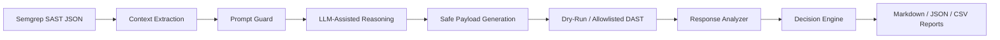

# Heimdall-SecurityV2

[](https://www.python.org/)
[](https://github.com/ZENLIK02/HeimDall-SecurityV2/actions/workflows/heimdall-devsecops.yml)
[](LICENSE)
[](CHANGELOG.md)

Heimdall is **an open-source DevSecOps validation backend that reduces SAST false positives using LLM-assisted reasoning and safe DAST-style verification**.

It is for AppSec engineers, DevSecOps teams, students, and researchers who want to test whether static findings can be converted into evidence-backed decisions: `True Positive`, `False Positive`, or `Needs Review`.

Heimdall is an alpha-stage research/backend tool. It is not a production-ready enterprise platform, and it should only be tested on repositories and targets you own or are authorized to assess.

## 5-Minute Quickstart

```bash
git clone https://github.com/ZENLIK02/HeimDall-SecurityV2.git
cd HeimDall-SecurityV2
pip install -r requirements.txt
python -m heimdall.cli experiment --dataset data/sample_alerts.jsonl --mode all --output reports/
python -m heimdall.cli validate --semgrep test_data/semgrep-results-sample.json --config heimdall.yml --output reports/
```

Expected files:

- `reports/summary.md`
- `reports/summary.json`
- `reports/results.csv`
- `reports/ci_summary.md`

## What Problem It Solves

SAST tools are valuable because they scale across a codebase, but they often produce findings that need manual triage. Heimdall adds a validation layer that:

- ingests Semgrep JSON,
- extracts alert context,
- uses structured LLM-style reasoning through a mock provider by default,
- generates non-destructive validation hypotheses,
- performs dry-run or allowlisted DAST-style validation,
- explains the final decision,
- produces CI/CD-friendly reports.

## Streamlit Prototype Capabilities

- Safe ZIP extraction blocks path traversal and skips dependency folders such as `node_modules`, `.git`, and `__pycache__`.
- SAST-only mode no longer requires an OpenAI API key.
- Semgrep failures are shown clearly instead of silently producing empty results.
- Semgrep is launched from PATH first, then through the active Python module path as a fallback.
- All findings are ranked and displayed instead of only using the first result.
- Users choose which finding to validate.
- DAST validation requires an explicit authorization checkbox.
- DAST target URLs are checked before live requests are sent.
- AI verdicts are combined with simple HTTP-response heuristics for better accuracy.
- AI JSON responses are handled safely so malformed model output does not crash the app.
- AI prompts apply prompt-injection guardrails by treating findings and HTTP evidence as untrusted data and truncating long fields before model review.
- API keys are read from Streamlit input or `OPENAI_API_KEY`, not hardcoded in source files.

## How It Works



## Why It Is Safe To Test

- Dry-run validation is enabled by default.
- Mock LLM mode is enabled by default.
- Active DAST is limited to configured `allowed_targets`.
- Production-looking domains are blocked unless explicitly enabled.
- Destructive payload markers are rejected.
- All DAST attempts are logged.
- `Needs Review` does not fail CI by default.

## CLI Commands

Check config safety:

```bash
python -m heimdall.cli check-config --config heimdall.yml
```

Run the research experiment:

```bash
python -m heimdall.cli experiment --dataset data/sample_alerts.jsonl --mode all --output reports/
```

Validate Semgrep output for CI/CD:

```bash
python -m heimdall.cli validate --semgrep test_data/semgrep-results-sample.json --config heimdall.yml --output reports/
```

## GitHub Actions

The workflow `.github/workflows/heimdall-devsecops.yml` runs on `push`, `pull_request`, and manual dispatch.

It:

- installs dependencies,
- installs Semgrep,
- runs Semgrep,
- saves `semgrep-results.json`,
- runs Heimdall validation,
- uploads reports as artifacts,
- optionally posts a pull request comment when GitHub context is available,
- fails only according to Heimdall policy.

Policy exit codes:

- `0`: no confirmed High/Critical True Positive found.
- `0`: only False Positive or Needs Review findings exist.
- `1`: confirmed High/Critical True Positive found and policy says to fail.
- `2`: invalid or unsafe config.
- `3`: runtime error.

## Reports

Research reports:

- `reports/summary.md`
- `reports/summary.json`
- `reports/results.csv`
- `reports/error_analysis.md`

CI/CD reports:

- `reports/ci_summary.md`
- `reports/ci_results.json`
- `reports/ci_results.csv`

Static demo examples are included:

- `reports/demo_summary.md`
- `reports/demo_ci_summary.md`

## Example Output

| Metric | Value |
|---|---:|
| Total Semgrep findings | 4 |
| Confirmed True Positives | 0 |
| False Positives | 3 |
| Needs Review | 1 |
| Pipeline status | PASSED |
| Report path | `reports/ci_summary.md` |

Example finding table:

| Rule ID | Severity | File | Line | Heimdall Decision | Evidence | Recommended Action |
|---|---|---|---:|---|---|---|
| python.flask.security.xss.reflected-xss | high | `test_apps/flask_vulnerable_app/app.py` | 18 | False Positive | Controlled marker appears escaped or inert. | Document the defensive control or tune the SAST rule. |
| python.flask.security.idor | low | `test_apps/flask_vulnerable_app/app.py` | 47 | Needs Review | Authentication context is required. | Review manually before active validation. |

## Local Vulnerable Test App

The local demo app is intentionally vulnerable and uses dummy data only:

```bash
cd test_apps/flask_vulnerable_app
python -m pip install flask
python app.py
```

Then run Heimdall from the repository root:

```bash
python -m heimdall.cli validate --semgrep test_data/semgrep-results-sample.json --config heimdall.yml --output reports/
```

## Docker Demo

```bash
docker build -t heimdall-security-v2 .
docker run --rm -v "%cd%/reports:/app/reports" heimdall-security-v2
```

On macOS/Linux:

```bash
docker run --rm -v "$PWD/reports:/app/reports" heimdall-security-v2
```

Docker runs the sample validation command in dry-run mode.

## Current Limitations

- Alpha-stage research backend.
- Default validation is conservative and dry-run based.
- Business logic flaws often need multi-step authenticated context.
- Real LLM provider integration is intentionally behind schema validation.
- The included datasets are small and synthetic.
- External target validation requires careful allowlist configuration.

## Roadmap

See `docs/roadmap.md` for the public roadmap.

Short version:

- `v0.1.0-alpha`: Semgrep ingestion, baseline comparison, dry-run validation, reports, GitHub Actions demo.
- `v0.2.0`: PR comment bot, improved Semgrep compatibility, better response analyzer, local vulnerable app integration.
- `v0.3.0`: authenticated testing support, OpenAPI endpoint mapping, RAG for multi-file context.
- `v0.4.0`: GitLab CI support, Docker image, PyPI package.

## Keywords

Suggested GitHub topics:

`devsecops`, `sast`, `dast`, `semgrep`, `application-security`, `appsec`, `cybersecurity`, `llm-security`, `security-automation`, `ci-cd`, `github-actions`, `false-positive-reduction`, `vulnerability-validation`

## Contributing

External testing feedback is welcome. Start with:

- `CONTRIBUTING.md`
- `SECURITY.md`
- `docs/community_feedback.md`
- `.github/ISSUE_TEMPLATE/devsecops_test_feedback.md`

Please do not share real secrets, production target details, or private vulnerability data in public issues.
