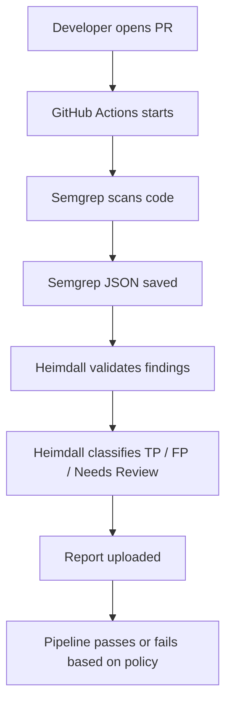

# Heimdall DevSecOps Integration

Heimdall V2 can run as a CI/CD security validation backend. In this mode, Semgrep produces static findings, Heimdall converts those findings into alert objects, the validation pipeline classifies each alert, and the CLI returns a policy-based exit code.

## CI/CD Workflow



## GitHub Actions Flow

The workflow `.github/workflows/heimdall-devsecops.yml` installs Python dependencies, installs Semgrep, writes `semgrep-results.json`, runs `python -m heimdall.cli validate`, uploads reports, and optionally posts `reports/ci_summary.md` to pull requests.

## Semgrep-To-Heimdall Data Flow

1. Semgrep writes JSON results.
2. `heimdall.semgrep_ingest` preserves rule ID, severity, file path, line number, message, snippet, and CWE metadata where available.
3. Findings are converted into Heimdall `Alert` objects.
4. The existing prompt guard, mock LLM provider, payload generator, DAST executor, response analyzer, and decision engine run in dry-run mode by default.
5. CI reports are written to `reports/`.

## Policy Decision Logic

- Exit code `0`: no confirmed High/Critical True Positive was found.
- Exit code `0`: only False Positive or Needs Review findings exist.
- Exit code `1`: confirmed High/Critical True Positive exists and policy says to fail.
- Exit code `2`: config is invalid or unsafe.
- Exit code `3`: runtime error.

Needs Review does not fail the pipeline by default because it means the system lacks enough context for safe automated validation.

## Safety Model

- Dry-run is enabled by default.
- Mock LLM is enabled by default.
- DAST refuses targets not present in `security.allowed_targets`.
- Production-looking domains are rejected unless `security.allow_external_targets` is explicitly enabled.
- Blocked targets cannot also be allowlisted.
- Every DAST attempt is logged.
- The kill switch stops DAST immediately.

## Local Integration Test

Start the local test app:

```bash
cd test_apps/flask_vulnerable_app
python -m pip install flask
python app.py
```

Run Heimdall with the sample Semgrep output:

```bash
python -m heimdall.cli check-config --config heimdall.yml
python -m heimdall.cli validate --semgrep test_data/semgrep-results-sample.json --config heimdall.yml --output reports/
```

Read `reports/ci_summary.md` for the CI-friendly result.

## Limitations

- The default validation path is conservative and dry-run based.
- Authenticated and multi-step workflows require additional context.
- Real LLM providers should remain behind the structured output validator.
- Production deployment requires audited target allowlists, secret management, and review of policy thresholds.
