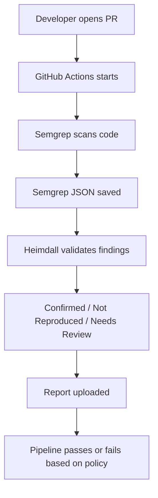

# Heimdall DevSecOps Integration

Heimdall V2 includes a deterministic bounded DAST path and a legacy dry-run CI
adapter. The bounded DAST path requires an explicit alert-to-runtime manifest;
raw Semgrep output alone does not authorize network execution.

## CI/CD Workflow



## GitHub Actions Flow

The existing workflow `.github/workflows/heimdall-devsecops.yml` runs the legacy
dry-run `validate` command. It is retained as a compatibility example and is not
the bounded DAST evaluation path.

## Semgrep-To-Heimdall Data Flow

1. Semgrep writes JSON results.
2. `heimdall.semgrep_ingest` preserves rule ID, severity, file path, line number, message, snippet, and CWE metadata where available.
3. Findings are converted into Heimdall `Alert` objects.
4. A separately reviewed manifest adds the relative endpoint, fixed GET/POST
   parameters, exact loopback target, and evidence predicates.
5. `python -m heimdall.cli bounded-dast` performs the safety preflight and sends
   at most one request per executable alert.
6. JSON, CSV, and Markdown audit reports are written to the selected output
   directory.

## Policy Decision Logic

- Exit code `0`: no confirmed High/Critical True Positive was found.
- Exit code `0`: only Not Reproduced Under Test or Needs Review findings exist.
- Exit code `1`: confirmed High/Critical True Positive exists and policy says to fail.
- Exit code `2`: config is invalid or unsafe.
- Exit code `3`: runtime error.

Needs Review does not fail the pipeline by default because it means the system lacks enough context for safe automated validation.

## Safety Model

- Bounded DAST is disabled unless configured explicitly.
- The bounded path uses no LLM.
- Only exact loopback origins in `active_validation.allowed_targets` are accepted.
- Exactly one GET or POST is allowed per executable alert.
- Redirects are never followed and captured responses are size-limited.
- Missing evidence, runtime context, or authorization returns Needs Review.
- Every sent or blocked attempt is logged.
- The kill switch stops DAST immediately.

## Local Integration Test

Start the local test app:

```bash
python scripts/run_bounded_dast_controlled.py
```

Or start the included local lab and run the bounded DAST command directly:

```bash
python -m heimdall.cli check-config --config heimdall.yml
python -m heimdall.cli bounded-dast \
  --dataset test_data/heimdall_active_local_alerts.jsonl \
  --config heimdall.yml \
  --output reports/bounded_dast
```

Read `reports/bounded_dast/summary.md` and `results.json`.

## Limitations

- SAST alerts require a separately reviewed runtime mapping before execution.
- Authenticated and multi-step workflows require additional context.
- The bounded protocol rejects production and other non-loopback targets.
- Not Reproduced Under Test is not proof that an alert is a false positive.
